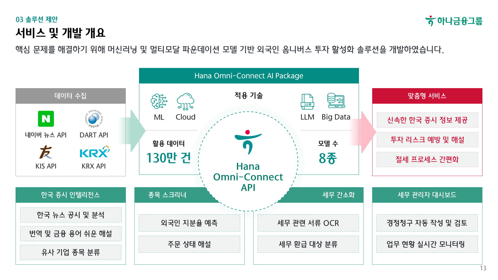
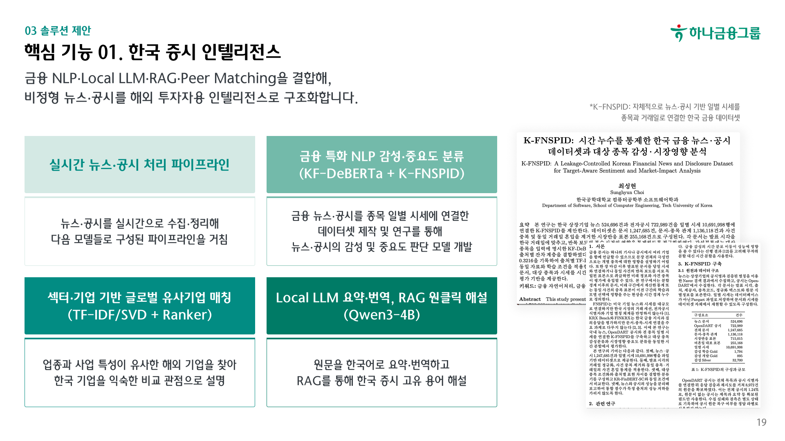
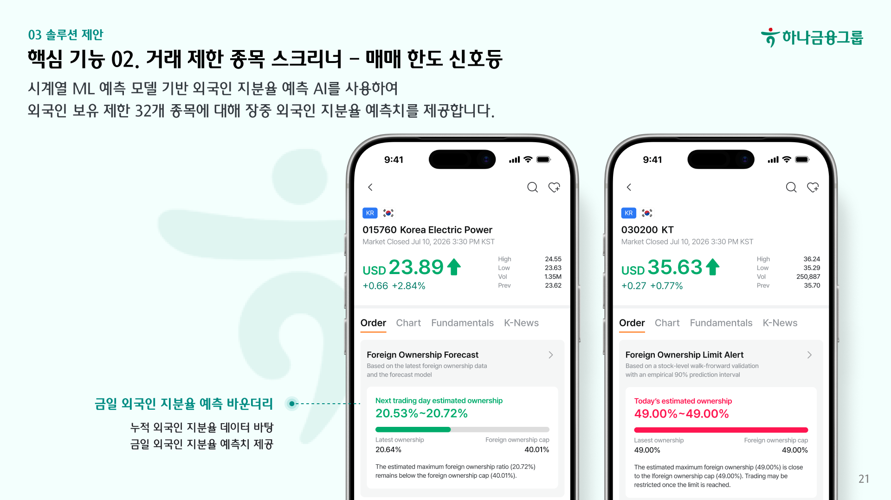
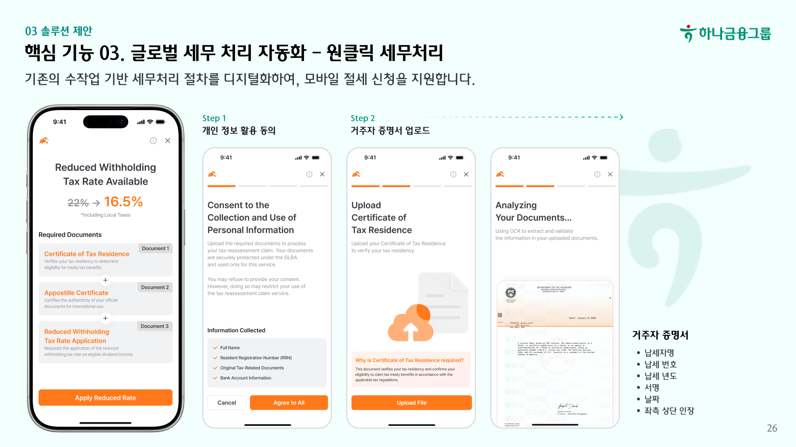
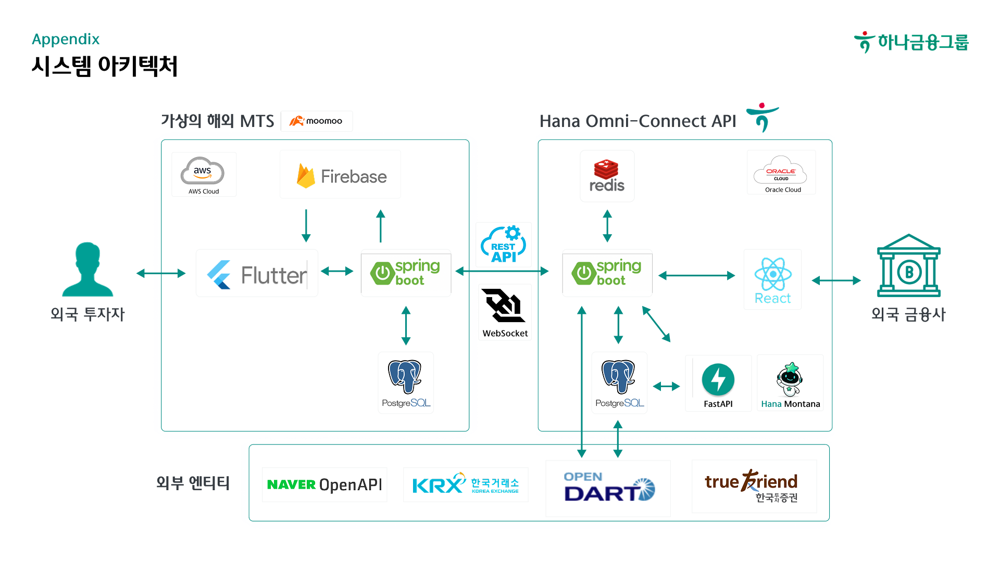

# Hana Harmony

> AI 기반 외국인 옴니버스 투자 활성화 솔루션
>
> AI-powered infrastructure for understanding and accessing the Korean equity market


Hana Harmony는 해외 거래소·브로커가 한국 주식 시장 데이터와 AI 인텔리전스, 거래 제한 신호, 글로벌 세무 문서 처리 기능을 자사 서비스에 연결할 수 있도록 만든 B2B2C 프로젝트입니다.

실시간 투자 화면부터 뉴스·공시 분석, 외국인 보유 한도 예측, 제한세율 적용 서류 검증까지 하나의 연동 흐름으로 제공합니다. 실제 주문·체결·정산·환전과 최종투자자 원장은 협력사 시스템의 책임으로 분리합니다.

## 팀 역할

| 이름 | 역할 |
| --- | --- |
| 김영운 | PM |
| 이윤서 | Researcher |
| 여아현 | Design |
| 최성현 | Backend · Infra · AI(기능 1·2) |
| 박민정 | Frontend · AI(기능 3) |

## 서비스 개요



| 핵심 기능 | 제공 가치 |
| --- | --- |
| 한국 증시 인텔리전스 | 뉴스·공시 수집, 종목 연결, 감성·중요도·시장영향 분석, 영문 전문과 What/Why/Impact, 금융 용어 해설, 글로벌 피어 비교 |
| 거래 제한 종목 스크리너 | 실시간 시세·호가·차트, 외국인 보유 한도 예측, VI·상하한가·거래정지와 주문 제한 신호 |
| 글로벌 세무 처리 자동화 | 거주자 증명서·아포스티유·제한세율 적용신청서 OCR, 문서 간 교차 검증, 수동 검수와 공식 PDF 처리 |

| 한국 증시 인텔리전스 | 거래 제한 종목 스크리너 | 글로벌 세무 처리 자동화 |
| --- | --- | --- |
|  |  |  |

## 시스템 구성



```text
Naver News · OpenDART · KIS · KRX · FX
                      │
                      ▼
             Hana Omni-Connect API ◀──▶ Hannah Montana AI
                      ▼
              Stock-exchange-BE
                      │
                      ▼
       Stock-exchange-FE (iOS · Android)
```

| 저장소 | 역할 | 기술 |
| --- | --- | --- |
| [Hanah-OmniLens-API](https://github.com/Hana-harmony/Hanah-OmniLens-API) | 시장·뉴스·공시 수집, 협력사 B2B REST/WebSocket, 인증·포털·세무 orchestration | Java 17, Spring Boot, PostgreSQL, Redis |
| [Hannah-Montana-AI](https://github.com/Hana-harmony/Hannah-Montana-AI) | 금융 NLP, 번역, K-FNSPID 시장영향, 글로벌 피어, 외국인 보유 예측, 세무 OCR | Python, FastAPI, KF-DeBERTa, Qwen |
| [Hanah-Tax-OCR](https://github.com/Hana-harmony/Hanah-Tax-OCR) | 세무 문서 특화 OCR·parser·reviewer, 평가·증강·검수 loop | Python, PaddleOCR, OpenCV, Pydantic |
| [Stock-exchange-BE](https://github.com/Hana-harmony/Stock-exchange-BE) | 사용자·계좌·관심종목·모의 원장·알림·세무 상태와 앱 API | Java 17, Spring Boot, PostgreSQL |
| [Stock-exchange-FE](https://github.com/Hana-harmony/Stock-exchange-FE) | 영어권 사용자를 위한 iOS·Android MTS UI | Flutter, Dart, REST, WebSocket |
